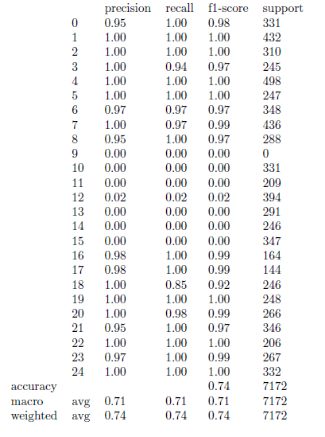

# hand-gesture-recognition
Translating hand gestures to English letters

## Roles
- Bach: generate data + preprocess data + model
- Dat: generate data + web app 
- H.Nam: generate data + web app
- P.Nam: test models

## Dataset:
  - Train data: 
      - sign_mnist_train: https://www.kaggle.com/datamunge/sign-language-mnist
        - 
        - 
        - 
      - custom: https://drive.google.com/file/d/1G9HsXqpyc7MHf9C9lvWrM1LK20iHj94K/view
        - indoor capture (4 lightning schemes) + on-class capture (1 lightning schemes)
        - 
        - 
        -  

## Model: 
  - 25GB RAM - GPU: https://colab.research.google.com/drive/1NlmPOHSN26Brrl51WAZfgiof8m7lJJMb?usp=sharing
  - ref: https://www.kaggle.com/sayakdasgupta/sign-language-classification-cnn-99-40-accuracy

## Evaluation
  - Test dataset: On-class
  - sign_mnist_train.csv:
    - 
  - sign_mnist_train_custom.csv:
    - 

## To-do
- test other models (P.Name)
- Web app: (Dat + H.Name)
    - front-end ?
    - back-end ?
        - web server (run test.py file to generate base64 code for image)
        - CPU or GPU spec?
- report